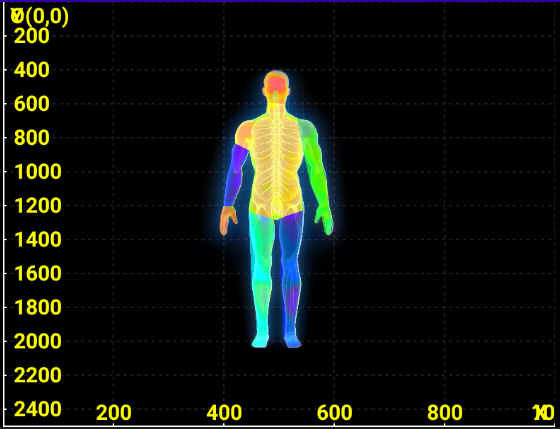

# BodyHeartMap - 人体热力图可视化库


<p align="center">
  
</p>

- 详细的介绍：[Your Blog](https://yourblog.com)

## 📝 简介

BodyHeartMap是一个基于OpenGL ES的Android人体热力图可视化库，专为医疗健康、运动科学和人体工程学等领域设计。该库提供了高效、直观的人体温度分布可视化功能，支持实时数据更新和交互控制。

## ✨ 特性

- 🔄 基于OpenGL ES 2.0的高性能渲染
- 🌡️ 温度数据到热力图的平滑映射
- 👆 支持缩放、平移等交互操作
- 🧩 模块化设计，易于集成和扩展
- 📊 内置3D坐标系可视化
- 🔍 支持透明度调节
- 📱 针对移动设备优化

## 文件夹介绍
- `bodyheartmaplib`：核心库，包含热力图渲染逻辑和数据处理
- `app`：示例应用，展示如何使用BodyHeartMap库
- `BodyMap`：opencv 提取人体关键点，分割人体部分


## 🛠️ 安装

### Gradle

在应用模块的 `build.gradle` 文件中添加依赖：

```groovy
dependencies {
    implementation project(':bodyheartmaplib')
}
```

### 本地AAR文件

1. 下载最新的 [bodyheartmaplib-release.aar](https://github.com/yourusername/BodyHeartMap/releases)
2. 将AAR文件复制到您项目的 `libs` 目录
3. 在应用模块的 `build.gradle` 文件中添加：

```groovy
dependencies {
    implementation files('libs/bodyheartmaplib-release.aar')
}
```

## 📋 使用方法

### 基本用法

1. 在布局XML中添加热力图视图：

```xml
<com.aj.bodyheartmaplib.HeatMapView
    android:id="@+id/heatMapView"
    android:layout_width="match_parent"
    android:layout_height="match_parent" />
```

2. 在Activity或Fragment中初始化并使用：

```java
// 获取视图引用
HeatMapView heatMapView = findViewById(R.id.heatMapView);

// 设置温度数据
float[] temperatures = new float[] {
    36.5f, // 头部
    36.6f, // 颈部
    36.7f, // 胸部
    36.8f, // 腹部
    36.6f, // 左肩
    36.4f, // 左臂
    36.3f, // 左手
    36.7f, // 右肩
    36.5f, // 右臂
    36.4f, // 右手
    36.3f, // 左大腿
    36.2f, // 左小腿
    36.4f, // 右大腿
    36.3f  // 右小腿
};
heatMapView.updateTemperatureData(temperatures);

// 设置透明度
heatMapView.updateGlAlpha(0.8f);
```


### 交互控制

```java
// 缩放
heatMapView.setScaleFactor(1.5f);

// 移动
heatMapView.setOffsetX(0.1f);
heatMapView.setOffsetY(-0.2f);

// 坐标轴缩放
coordinateView.setAxisScale(1.2f);
```

## 📚 API文档

### HeatMapView

| 方法 | 描述 |
| --- | --- |
| `updateTemperatureData(float[] temperatures)` | 更新温度数据 |
| `updateGlAlpha(float alpha)` | 设置热力图透明度 (0.0-1.0) |
| `setScaleFactor(float scale)` | 设置缩放因子 |
| `setOffsetX(float offset)` | 设置X轴偏移 |
| `setOffsetY(float offset)` | 设置Y轴偏移 |


### BodyHeatMapManager

| 方法 | 描述 |
| --- | --- |
| `getInstance(Context context)` | 获取管理器实例 |
| `createHeatMapView()` | 创建热力图视图 |
| `createCoordinateView()` | 创建3D坐标系视图 |
| `getVersion()` | 获取库版本信息 |


## 🧪 技术细节

### 人体轮廓提取

项目包含了一个Python模块，用于从图像中提取人体轮廓并将其分割为不同的身体部位：

```python
def split_body_parts(contour_points):
    """
    按照指定的索引范围将轮廓点分割成不同的身体部位
    """
    # 定义各部位的索引范围
    body_parts = {
        "头部": [*range(0, 9), *range(111, 120)],
        "颈部": [*range(8, 11), *range(109, 112)],
        # ... 其他部位
    }
    
    # 创建各部位的点集
    parts_points = {}
    for part_name, indices in body_parts.items():
        parts_points[part_name] = [contour_points[i] for i in indices]
    
    return parts_points
```

### OpenGL渲染

使用OpenGL ES 2.0实现高效渲染：

```java
// 顶点着色器
private static final String VERTEX_SHADER =
        "uniform mat4 uMVPMatrix;" +
        "attribute vec4 aPosition;" +
        "attribute vec4 aColor;" +
        "uniform float uPointSize;" +
        "varying vec4 vColor;" +
        "void main() {" +
        "  gl_Position = uMVPMatrix * aPosition;" +
        "  gl_PointSize = uPointSize;" +
        "  vColor = aColor;" +
        "}";

// 片段着色器
private static final String FRAGMENT_SHADER =
        "precision mediump float;" +
        "varying vec4 vColor;" +
        "void main() {" +
        "  gl_FragColor = vColor;" +
        "}";
```

## 📱 应用场景

- **医疗诊断**：可视化患者体表温度分布，辅助医生诊断炎症、血液循环问题等
- **运动科学**：分析运动员在不同运动状态下的肌肉热量分布
- **健康监测**：个人健康应用中监测体温异常
- **人体工程学研究**：评估不同环境条件下人体的热舒适度

## 🔮 未来计划

- [ ] 支持3D人体模型
- [ ] 添加更多热力图颜色主题
- [ ] 实现温度变化动画
- [ ] 集成机器学习模型进行异常检测
- [ ] 支持Kotlin协程

## 🤝 贡献

欢迎贡献代码、报告问题或提出新功能建议！请查看 [贡献指南](CONTRIBUTING.md) 了解更多信息。

## 📄 许可证

本项目采用 [Apache License 2.0](LICENSE) 许可证。
